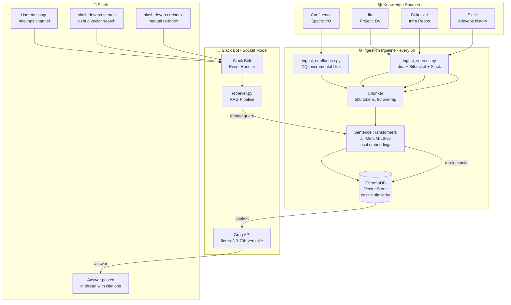

# Slack QnA Bot — DevOps RAG Assistant

A production-ready Slack bot that answers infrastructure questions in real time using Retrieval-Augmented Generation (RAG) over your team's entire knowledge base.

**Sources indexed:** Confluence · Jira · Bitbucket · Slack history  
**LLM:** Groq (`llama-3.3-70b-versatile`) — free tier  
**Embeddings:** `all-MiniLM-L6-v2` — fully local, no API needed  
**Vector store:** ChromaDB (persistent, on-disk)

---

## Screenshots

### Bot answering an infra question in Slack


---

## Architecture



---

## How It Works

```
User sends message in #devops
        │
        ▼
Slack Bolt (Socket Mode) receives event
        │
        ▼
retriever.py — RAG Pipeline
  ├─ 1. Embed the question (all-MiniLM-L6-v2, local)
  ├─ 2. Search ChromaDB — top 6 semantically similar chunks
  ├─ 3. Build prompt with context + source citations
  └─ 4. Call Groq LLM → stream answer
        │
        ▼
Reply posted in thread with clickable source links
(Confluence pages, Jira tickets, Slack messages)
```

**Ingestion logic:**
- On first run → full index of all sources
- Every 6h → incremental (only items updated since last run)
- `/devops-reindex` → incremental | `/devops-reindex full` → force full re-index

---

## Setup

### 1. Create the Slack App

1. Go to https://api.slack.com/apps → **Create New App** → **From scratch**
2. **Socket Mode** → enable → generate App-Level Token (`connections:write`) → `SLACK_APP_TOKEN`
3. **OAuth & Permissions** → Bot Token Scopes:
   - `channels:history`, `channels:read`, `groups:history`, `groups:read`
   - `chat:write`, `reactions:read`, `reactions:write`, `users:read`
4. **Event Subscriptions** → Subscribe to bot events:
   - `message.channels`, `message.groups`, `app_mention`
5. **Slash Commands** → create:
   - `/devops-reindex` — manual re-index trigger
   - `/devops-search` — debug vector search
6. Install app → copy **Bot User OAuth Token** → `SLACK_BOT_TOKEN`
7. Invite bot to your channel: `/invite @your-bot-name`

### 2. Configure Environment

```bash
cp .env.example .env
# Fill in all values
```

Key variables:

| Variable | Description |
|---|---|
| `SLACK_APP_TOKEN` | `xapp-...` — Socket Mode app token |
| `SLACK_BOT_TOKEN` | `xoxb-...` — Bot OAuth token |
| `DEVOPS_CHANNEL_ID` | Channel ID where bot listens |
| `SLACK_HISTORY_CHANNEL_ID` | Channel to ingest history from |
| `GROQ_API_KEY` | Free at console.groq.com |
| `CONFLUENCE_URL` | `https://yourcompany.atlassian.net` |
| `CONFLUENCE_USERNAME` | Your Atlassian email |
| `CONFLUENCE_API_TOKEN` | Atlassian API token |
| `CONFLUENCE_SPACE_KEY` | Space to index (e.g. `DEVOPS`) |
| `JIRA_URL` | Same as Confluence URL |
| `JIRA_PROJECT_KEY` | Project to index (e.g. `INFRA`) |
| `INGEST_SCHEDULE_HOURS` | Re-index interval (default `6`) |

### 3. Install Dependencies

```bash
python -m venv .venv
source .venv/bin/activate      # Windows: .venv\Scripts\activate
pip install -r requirements.txt
```

### 4. Run

```bash
python main.py
```

Bot connects to Slack immediately. Ingestion runs in the background.

### 5. Test Without Slack

```bash
python test_rag.py "how do I deploy to production?"
```

---

## File Structure

```
devops-bot/
├── main.py              # Entrypoint — wires everything together
├── bot.py               # Standalone Slack skeleton
├── vector_store.py      # ChromaDB wrapper (upsert, search, delete)
├── retriever.py         # RAG pipeline + Groq LLM answer generation
├── ingest_confluence.py # Confluence ingestion (full + CQL incremental)
├── ingest_sources.py    # Jira · Bitbucket · Slack history ingestion
├── test_rag.py          # Smoke test (no Slack needed)
├── requirements.txt
├── .env.example
└── data/
    └── chroma/          # Persisted vector DB (gitignored)
```

---

## Slash Commands

| Command | Description |
|---|---|
| `/devops-search <query>` | Direct vector search — shows top 3 chunks with scores |
| `/devops-reindex` | Incremental re-index of all sources |
| `/devops-reindex full` | Force full re-index (wipes and rebuilds) |

---

## Future Scope

### 🔌 More Knowledge Sources
- **PagerDuty** — index past incidents and postmortems for RCA queries
- **Grafana / Prometheus** — pull runbook links and alert annotations
- **GitHub** — index IaC, Helm charts, and CI workflow files
- **Notion / Google Docs** — for teams not on Confluence
- **Datadog logs** — surface recent error patterns as context

### 🧠 Smarter Retrieval
- **Hybrid search** — combine BM25 keyword search with vector similarity (reciprocal rank fusion)
- **Re-ranking** — add a cross-encoder reranker pass before sending to LLM
- **Query expansion** — auto-generate 3 search queries from one question, merge results
- **Parent-child chunking** — retrieve small precise chunks but send surrounding parent context to LLM

### 🤖 Agentic Capabilities
- **On-call routing** — detect incidents, auto-page the right team via PagerDuty
- **Runbook execution** — allow bot to trigger Jenkins jobs or kubectl commands with approval
- **Jira ticket creation** — bot creates a ticket if it can't answer the question
- **Follow-up context** — maintain per-thread conversation history for multi-turn Q&A

### 📊 Observability
- **Answer feedback** — thumbs up/down reactions logged to a database
- **Usage analytics** — track which sources are cited most, which queries go unanswered
- **Retrieval quality dashboard** — monitor embedding drift and chunk coverage over time

### ☁️ Deployment
- **Dockerize** — `Dockerfile` + `docker-compose.yml` for one-command startup
- **Kubernetes** — Helm chart for deploying to your infra cluster
- **Managed vector DB** — swap ChromaDB for Pinecone or Weaviate for scale
- **Switch to OpenAI / Bedrock** — drop-in LLM swap via env variable
- **CI/CD re-index** — trigger ingestion on Confluence publish webhook or Jira issue update

---

## Extending

| Goal | Where to change |
|---|---|
| Add a new knowledge source | Create `ingest_<source>.py`, call it in `main.py:run_ingestion()` |
| Change answer style / tone | Edit `SYSTEM_PROMPT` in `retriever.py` |
| Add escalation logic | Add routing in `main.py:on_message()` after answer is generated |
| Switch vector DB | Replace `VectorStore` internals — interface stays the same |
| Switch LLM | Change `base_url` + model in `retriever.py` |
